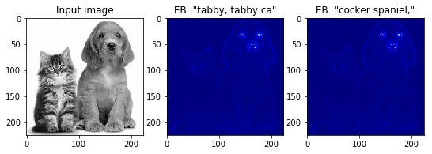
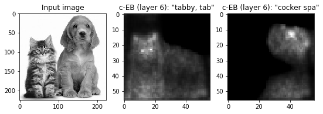
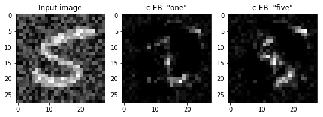

excitationbp: visualizing how deep networks make decisions
=======
Sam Greydanus. March 2018. MIT License.

Oregon State University College of Engineering. [Explainable AI Project](http://twitter.com/DARPA/status/872547502616182785). Supported by DARPA.

_Written in PyTorch_


About
--------
This is a PyTorch implementation of _contrastive excitation backprop (EB)_ (see [this paper](https://arxiv.org/abs/1608.00507) and [original code](https://github.com/jimmie33/Caffe-ExcitationBP) in Caffe). The idea of EB is to visualize what causes a given neuron to fire. We perform backprop _only_ on positive weights and keep the gradient normalized to 1. The gradient on the original image can then be loosely interpreted as the probability that a given pixel will excite that neuron.

Contrastive EB is a little different. We backprop both a positive and a negative activation of the neuron of interest through the layer immediately below it. Then we sum these two signals and perform EB over the remaining layers as usual. This signal can be loosely interepreted as the probability that a given pixel will:

* excite the neuron.
* not inhibit the neuron.

We performed experiments on

 * a fully-connected MNIST classifier (see [**`tutorial-mnist.ipynb`**](https://nbviewer.jupyter.org/github/greydanus/excitation_bp/blob/master/tutorial-mnist.ipynb))
 * a VGG16 ImageNet classifier (see [**`tutorial-imagenet.ipynb`**](https://nbviewer.jupyter.org/github/greydanus/excitation_bp/blob/master/tutorial-imagenet.ipynb))

How to use
--------

A minimal example of how to install/use this project:

```python
# clone the repo
git clone https://github.com/greydanus/excitationbp.git
# enter the repo
cd excitationbp
# install the package
python setup.py install
# enter the python command line
python
# import the EB module
import excitationbp as eb
# enter excitation backprop mode
# 		(this replaces some of PyTorch's internal autograd functions)
eb.use_eb(True)
# perform excitation backprop
#		model: a PyTorch module
#		inputs: a PyTorch Variable that will be passed to the model
#		prob_outputs: probability distribution over outputs
#			(usually all zeros except for a 1 on the neuron you want to inspect)
#		contrastive: boolean, whether to use EB or contrastive EB
#		target_layer: int, relates to layer we want to visualize. 0 refers to input
prob_inputs = eb.utils.excitation_backprop(model, inputs, prob_outputs, contrastive=False, target_layer=0)
```

Check out the two Jupyter notebooks for detailed examples.


ImageNet Results
--------

Regular EB (has a hard time separating neuron-specific signals)



Contrastive EB (separates neuron-specific signals well)


Contrastive EB to a mid-level conv. layer



Noisy-MNIST Results
--------

I trained a simple fully-connected network on MNIST data + noise. Regular EB, again, had a hard time separating neuron-specific signals.


Contrastive EB separated the '1' vs '5' signals.



Runtime
--------

Computing a regular EB signal requires a single forward pass and a single backward pass. The same goes for the contrastive EB signal now (as of this update)

Dependencies
--------
All code is written in Python 3.6. You will need:

 * NumPy
 * Matplotlib
 * [PyTorch 0.3+](http://pytorch.org/): easier to write and debug than TensorFlow :)
 * [Jupyter](https://jupyter.org/)
