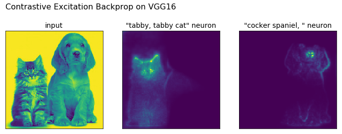
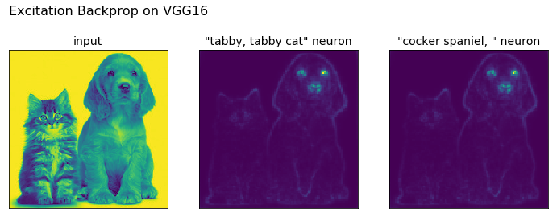
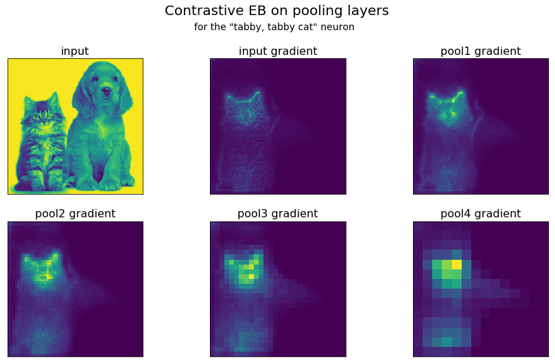
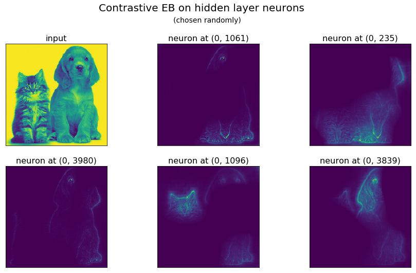

excitation_bp: visualizing how deep networks make decisions
=======
Sam Greydanus. July 2017. MIT License.

Oregon State University College of Engineering. [Explainable AI Project](http://twitter.com/DARPA/status/872547502616182785). Supported by DARPA.

_Written in PyTorch_

About
--------
This is a PyTorch implementation of _contrastive excitation backprop (EB)_ (see [this paper](https://arxiv.org/abs/1608.00507) and [original code](https://github.com/jimmie33/Caffe-ExcitationBP) in Caffe). The idea of EB is to visualize what causes a given neuron to fire. We perform backprop _only_ on positive weights and keep the gradient normalized to 1. The gradient on the original image can then be loosely interpreted as the probability that a given pixel will excite that neuron.

Contrastive EB is a little different. We backprop both a positive and a negative activation of the neuron of interest through the layer immediately below it. Then we sum these two signals and perform EB over the remaining layers as usual. This signal can be loosely interepreted as the probability that a given pixel will:

* excite the neuron.
* not inhibit the neuron.

We performed experiments on the VGG16 model. Results can be explored and replicated using [**`tutorial.ipynb`**](https://nbviewer.jupyter.org/github/greydanus/excitation_bp/blob/master/tutorial.ipynb)

Results
--------

Regular EB (has a hard time separating neuron-specific signals)

Contrastive EB (separates neuron-specific signals well)

Runtime
--------

Computing a regular EB signal requires a single forward pass and a single backward pass. Theoretically, the contrastive signal should as well.

Owing to the quirks of the current PyTorch version, the current implementation requires a single pass forward and three backward passes. The next release of PyTorch will include a `torch.autograd.grad` functions which will resolve this issue. Check back soon! _(Written 18 July 2017)_

Dependencies
--------
All code is written in Python 3.6. You will need:

 * NumPy
 * Matplotlib
 * [PyTorch](http://pytorch.org/): easier to write and debug than TensorFlow :)
 * [Jupyter](https://jupyter.org/)
